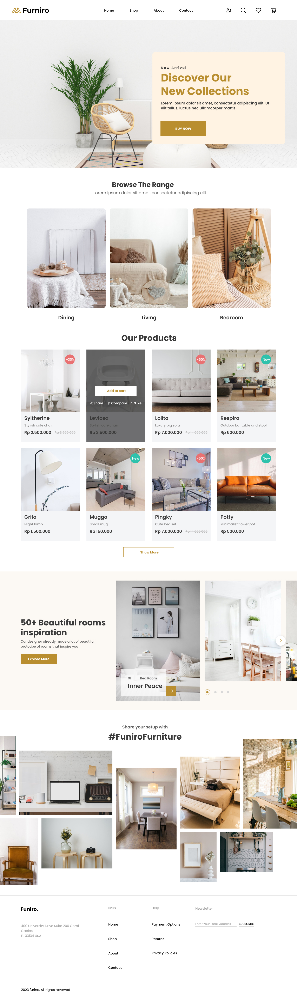

# 🪑 Furniro Furniture Website

A modern and elegant furniture eCommerce landing page built using HTML and CSS. This is a static frontend project for showcasing beautiful room designs, furniture collections, and a clean UI shopping experience.

---

## ✨ Features

- 💡 Hero section with bold new arrivals banner
- 🛋️ Category section for Dining, Living, and Bedroom
- 🛒 Product listing with discounts, badges, and hover effects
- 🖼️ Gallery with interior inspiration
- 📩 Email newsletter subscription
- 📍 Clean and modern responsive footer

---

## 🚀 Technologies Used

- HTML5
- CSS3 (Custom Properties / Flexbox / Responsive Design)
- Google Fonts (Segoe UI)

---

## 📁 Folder Structure

furniro-html/
│
├── index.html
├── README.md
├── assets/
│ ├── Css/
│ │ └── style.css
│ ├── Images/
│ │ └── [All image assets like banners, products, etc.]
│ └── svg/
│ └── [Icons used in the header]

---

## 📬 Contact

Made by Raish mohammad — feel free to reach out for collaboration or suggestions!

---